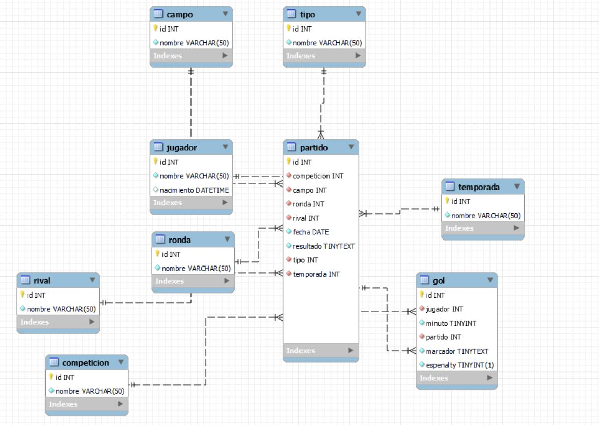

# Objetivo del proyecto
Practicar en el idioma de SQL para aprender los conceptos básicos.
# Origen de los datos
El origen de los datos son las tablas que he creado desde mi juego. Están en la carpeta /Datos.
# Programas y paquetes
Todas las consultas están elaboradas en MySQL
# EER Diagram de las tablas


# Procesos realizados
1. Unión de bases de datos desde el EER
2. Consultas a las bases de datos
3. Guardar en vistas las consultas más típicas

# Principales consultas y sus resultados

## Tabla de Hat-tricks
```
SELECT 
        j.nombre AS Jugador,
        COUNT(g.id) AS Goles,
        p.fecha AS Fecha,
        rv.nombre AS Rival,
        c.nombre AS Competición
    FROM
        ((((rsd_alcalá.gol g
        LEFT JOIN rsd_alcalá.jugador j ON ((j.id = g.jugador)))
        LEFT JOIN rsd_alcalá.partido p ON ((p.id = g.partido)))
        LEFT JOIN rsd_alcalá.rival rv ON ((rv.id = p.rival)))
        LEFT JOIN rsd_alcalá.competicion c ON ((c.id = p.competicion)))
    GROUP BY g.jugador , g.partido
    HAVING (Goles >= 3)
    ORDER BY Goles DESC
    LIMIT 5;
```
```
#Output
(Jugador, Goles, Fecha, Rival, Competición)
Raúl Noguerol	4	2013-09-22	Izarra	2ª División B
Álvaro Portilla	4	2013-12-08	Bezana	2ª División B
Raúl Noguerol	4	2014-02-16	S. Fernando de Henares	2ª División B
Raúl Noguerol	4	2014-03-02	Bilbao Ath.	2ª División B
Raúl Noguerol	4	2014-04-06	Lemona	2ª División B
```
## Cuenta de Hat-tricks por jugador
```
SELECT 
        rsd_alcalá.rank_hattricks.Jugador AS Jugador,
        COUNT(rsd_alcalá.rank_hattricks.Jugador) AS Hattricks
    FROM
        rsd_alcalá.rank_hattricks
    GROUP BY rsd_alcalá.rank_hattricks.Jugador
    ORDER BY Hattricks DESC;
```
```
#Output
(Jugador, Hattricks)
Raúl Noguerol	8
Álvaro del Moral	3
Kevin Mallo	2
Álvaro Portilla	1
Toni Miguel	1
Eric	1
Jordi Torres	1
```
## Cumplegol (¿Alguien ha metido el día de su cumple?)
```
SELECT g.id, j.nombre, j.nacimiento, p.fecha, 
  if (day(nacimiento) = day(fecha) and month(nacimiento) = month(fecha), TRUE, FALSE) as CumpleGol 

FROM gol g

LEFT JOIN jugador j on j.id = g.jugador
LEFT JOIN partido p on p.id = g.partido 

ORDER BY CumpleGol desc

LIMIT 5;
```
```
#Output 
(id, nombre, nacimiento, fecha, CumpleGol)
1	Álvaro Portilla	1986-04-27 00:00:00	2012-08-22	0
2	Marcos Cerrudo	1988-09-11 00:00:00	2012-08-22	0
3	Toni Miguel	1991-04-19 00:00:00	2012-09-02	0
4	Álvaro Portilla	1986-04-27 00:00:00	2012-09-02	0
5	Marcos Cerrudo	1988-09-11 00:00:00	2012-09-16	0
```
## Máximo de goles en un partido de un jugador
```
SELECT 
        j.nombre AS nombre,
        rv.nombre AS Equipo,
        COUNT(rv.nombre) AS Goles
    FROM
        (((rsd_alcalá.gol g
        LEFT JOIN rsd_alcalá.jugador j ON ((j.id = g.jugador)))
        LEFT JOIN rsd_alcalá.partido p ON ((p.id = g.partido)))
        LEFT JOIN rsd_alcalá.rival rv ON ((`rv`.id = p.rival)))
    GROUP BY p.rival , j.nombre
    ORDER BY Goles DESC
    LIMIT 10;
```
```
#Output
(nombre, Equipo, Goles)
Raúl Noguerol	Albacete	5
Álvaro del Moral	Fuenlabrada	5
Raúl Noguerol	Bilbao Ath.	5
Raúl Noguerol	Lemona	4
Kevin Mallo	Palencia	4
Raúl Noguerol	Espanyol	4
Álvaro Portilla	Bezana	4
Raúl Noguerol	Izarra	4
Raúl Noguerol	S. Fernando de Henares	4
Federico Cartabia	Rayo	4
```
# Lecciones aprendidas

1. Creación y manipulación básica de tablas
2. Elaboración de consultas y consultas sobre consultas
3. Base para mis conocimientos en SQL (En este caso, MySQL)
